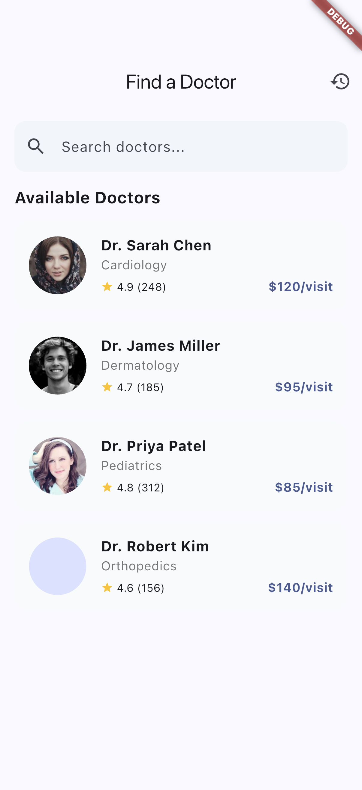
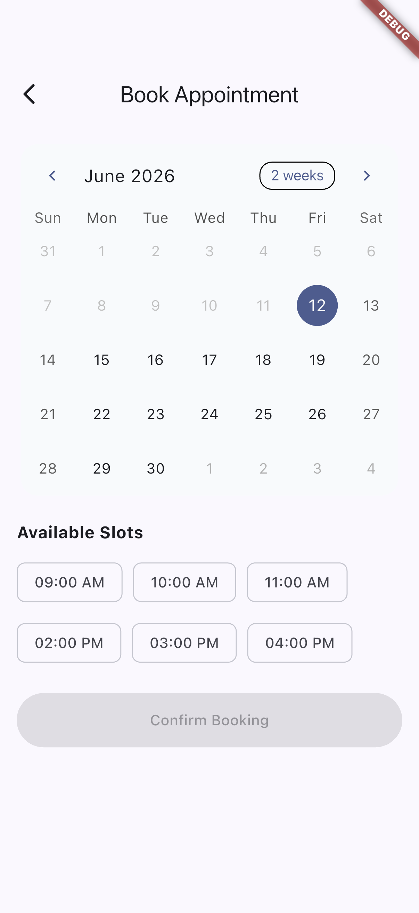
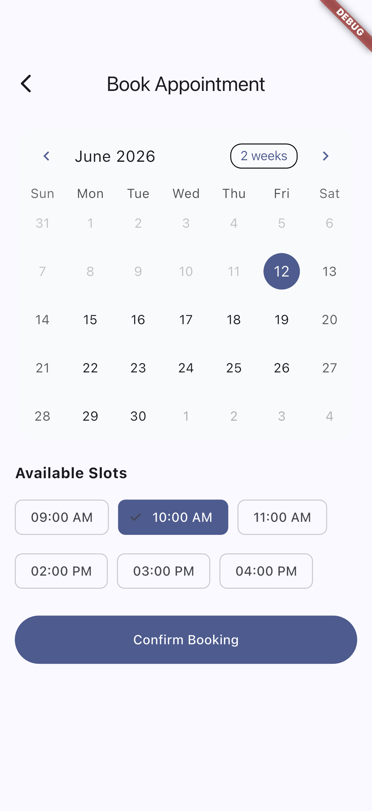
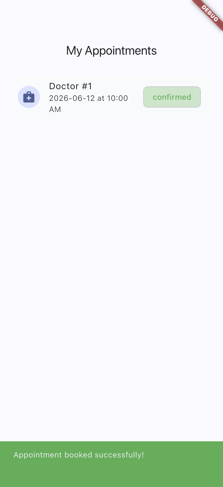
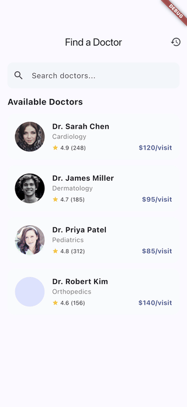

# flutter-doctor-appointment

Flutter + Riverpod doctor appointment booking app. Doctor listing, profile view, calendar-based time slot booking, full appointment history.

## Demo

Real iOS-Simulator captures from the running app (not mockups). See [FLOW.md](FLOW.md) for how they are generated.

| Doctor list | Doctor detail | Booking calendar |
| --- | --- | --- |
|  |  |  |

| Slot selected | Appointment history |
| --- | --- |
|  |  |



## Stack
- Flutter + Dart
- Riverpod (state management)
- go_router (navigation)
- table_calendar (date picker)
- Clean Architecture

## Features
- Doctor profile listing with specialty, rating, fee
- Doctor detail with bio and stats
- Calendar-based appointment booking
- Time slot selection
- Full appointment history

## Run
```
flutter pub get
flutter run
```
