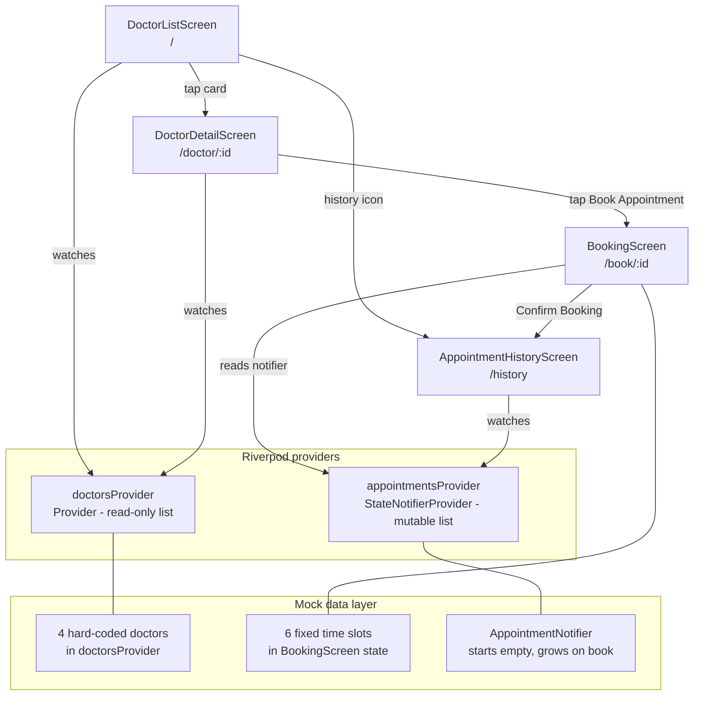

# flutter-doctor-appointment

A doctor appointment booking app built with **Flutter** and **Riverpod**. It covers the full patient flow: browse a list of doctors with specialty, experience, rating, and consultation fee; view a doctor profile; pick a date on a **TableCalendar** widget; select an available time slot; confirm the booking; and review the appointment history. Navigation is handled by **go_router**. The UI follows the **MedConnect** "Modern Medical" design system - a bright, light theme with a medical blue / teal palette, soft tinted "medical" shadows, rounded bento cards, pill chips, and a persistent bottom navigation bar.

## Demo

Real iOS Simulator captures from the running app (not mockups).


## Screenshots

| Doctor list | Doctor detail | Booking calendar |
| --- | --- | --- |
|  |  |  |

| Slot selected | Appointment history |
| --- | --- |
|  |  |

## Features

- MedConnect branded top bar (avatar + wordmark) and bottom navigation (Find / Schedule / History / Profile)
- Doctor listing cards with photo, specialty, years of experience, star rating, review count, favorite toggle, fee, and "Book Now"
- Search bar plus horizontally scrollable specialty filter chips (UI ready)
- Doctor detail screen with a photo hero + glass-style name overlay, a 2x2 bento stats grid (rating, fee, years, patients), bio with specialty tags, and a location preview
- Calendar-based date picker showing the next 60 days
- Six time slots per day (09:00 AM - 04:00 PM) as selectable bordered tiles
- Sticky confirm bar showing the selected slot and a "Confirm Booking" CTA
- Booking confirmation with a teal success snackbar
- Appointment history with filter chips, upcoming cards (status badge + reschedule) and a past-appointments list

## Stack

- **Flutter** (Dart, Material 3)
- **Riverpod** (flutter_riverpod ^2.4.0) - state management
- **go_router** ^13.0.0 - declarative routing
- **table_calendar** ^3.1.0 - date picker
- **cached_network_image** ^3.3.1 - avatar image caching
- **intl** ^0.19.0 - date formatting
- **integration_test** + **test_driver** - automated screenshot capture

## Architecture

```
lib/
├── main.dart                         # ProviderScope + GoRouter setup
├── core/
│   ├── theme/
│   │   └── app_theme.dart            # MedConnect ColorScheme + AppColors palette
│   └── widgets/
│       └── app_chrome.dart           # BrandAppBar, AppBottomNav, MedicalCard
└── features/
    ├── doctors/
    │   └── presentation/
    │       └── screens/
    │           ├── doctor_list_screen.dart   # doctorsProvider (in-memory list)
    │           └── doctor_detail_screen.dart # reads doctorsProvider by id
    └── appointments/
        └── presentation/
            └── screens/
                ├── booking_screen.dart           # appointmentsProvider (StateNotifier)
                └── appointment_history_screen.dart
```



## Mock data

All data is in-memory with no network calls at runtime.

**Doctors** (`lib/features/doctors/presentation/screens/doctor_list_screen.dart` - `doctorsProvider`):

Four seeded doctors exposed as a read-only `Provider<List<Map>>`:

| id | Name | Specialty | Exp | Rating | Reviews | Fee | Patients |
|----|------|-----------|-----|--------|---------|-----|----------|
| 1 | Dr. Sarah Chen | Cardiology | 12 yrs | 4.9 | 248 | $120 | 2k+ |
| 2 | Dr. James Miller | Dermatology | 15 yrs | 4.7 | 185 | $95 | 1.5k+ |
| 3 | Dr. Priya Patel | Pediatrics | 8 yrs | 4.8 | 312 | $85 | 3k+ |
| 4 | Dr. Robert Kim | Orthopedics | 20 yrs | 4.6 | 156 | $140 | 1.8k+ |

Doctor avatars are fetched from `i.pravatar.cc` (public placeholder CDN, no auth required).

**Time slots** (`lib/features/appointments/presentation/screens/booking_screen.dart`):

Six fixed slots available every day: `09:00 AM`, `10:00 AM`, `11:00 AM`, `02:00 PM`, `03:00 PM`, `04:00 PM`.

**Appointments** (`appointmentsProvider` / `AppointmentNotifier`):

Starts empty. Each confirmed booking appends `{doctorId, name, specialty, image, fee, date (ISO yyyy-MM-dd), slot, status: "confirmed"}` to in-memory state and surfaces under "Upcoming" in the history screen (the "Past" list is statically seeded for demo). Data resets when the app restarts (no persistence).

## Run

```bash
flutter pub get
flutter run
```
